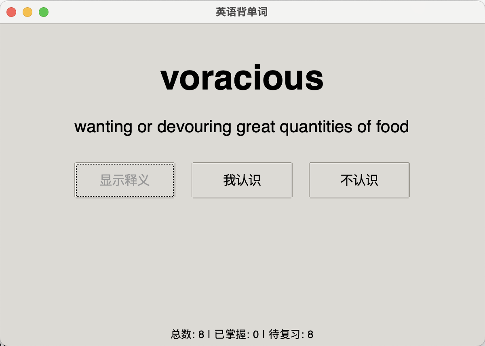

# 英语闪卡背单词程序 (English Flashcard Memorizer)

这是一个使用 Python 和 Tkinter 构建的桌面应用程序，旨在帮助用户通过闪卡（Flashcard）的形式记忆英语单词。程序会跟踪用户的学习进度，并优先复习用户不熟悉的单词。


## ✨ 主要功能

- **闪卡式学习**：一次只显示一个单词，用户可以主动回忆释义。
- **进度跟踪**：程序会区分“已掌握”和“待复习”的单词。
- **智能复习**：标记为“不认识”的单词会稍后再次出现，加强记忆。
- **自动保存**：退出程序时，学习进度会自动保存，下次启动时无缝衔接。
- **自定义词库**：通过简单的 CSV 文件轻松添加和管理自己的单词列表。
- **跨平台运行**：基于 Python 和 Tkinter，可在 Windows, macOS, Linux 上运行。

## 🚀 快速开始

### 准备环境

1.  **安装 Python**
    确保你的电脑上安装了 Python 3.8 或更高版本。你可以从 [python.org](https://www.python.org/downloads/) 下载。

2.  **安装 Tkinter 支持 (仅针对部分系统)**
    - **Windows**: 通常随 Python 安装包一同安装，无需额外操作。
    - **macOS**: 如果你使用 Homebrew 安装的 Python，请确保已安装 `tcl-tk`。
      ```bash
      brew install tcl-tk
      brew reinstall python
      ```
    - **Debian/Ubuntu Linux**:
      ```bash
      sudo apt-get update
      sudo apt-get install python3-tk
      ```

### 安装与运行 (推荐使用虚拟环境)

1.  **克隆或下载项目**
    将本项目代码下载到你的本地计算机，并进入项目根目录。
    ```bash
    git clone https://github.com/BillWang-dev/word_memorizer
    cd word_memorizer
    ```

2.  **创建并激活虚拟环境**
    在项目根目录下创建一个独立的 Python 环境，这可以避免与系统库产生冲突。

    *   **在 macOS / Linux 上:**
        ```bash
        python3 -m venv venv
        source venv/bin/activate
        ```

    *   **在 Windows 上:**
        ```bash
        python -m venv venv
        .\venv\Scripts\activate
        ```
    激活成功后，你的终端提示符前会出现 `(venv)`。

3.  **准备词库**
    在项目根目录下，创建一个名为 `words.csv` 的文件。这是一个逗号分隔的文件，用于存放你的单词。格式如下：

    ```csv
    word,meaning
    ubiquitous,"present, appearing, or found everywhere"
    ephemeral,"lasting for a very short time"
    serendipity,"the occurrence and development of events by chance in a happy or beneficial way"
    ```
    > **提示**: 如果单词释义中包含逗号，请用英文双引号 `"` 将其括起来。

4.  **运行程序**
    现在，在已激活的虚拟环境中，运行以下命令来启动程序：

    ```bash
    python word_memorizer.py
    ```
    程序窗口将会启动。

5.  **退出**
    当你完成使用后，可以在终端中输入以下命令来退出虚拟环境：
    ```bash
    deactivate
    ```

## 📖 如何使用

1.  程序启动后，会显示一个单词。
2.  自己先回忆一下单词的释义。
3.  点击 **“显示释义”** 按钮查看正确答案。
4.  根据你的掌握情况，点击：
    - **“我认识”**: 该单词将被标记为已掌握，短期内不会再出现。
    - **“不认识”**: 该单词会被放回复习队列的末尾，稍后会再次出现让你复习。
5.  当所有单词都标记为“我认识”后，本轮学习结束。
6.  关闭窗口时，程序会提示保存进度。下次启动时将从未掌握的单词开始。

## 🛠️ 技术栈

- **语言**: Python 3
- **GUI 框架**: Tkinter (Python 标准库)
- **数据格式**: CSV (用于词库), JSON (用于保存进度)

## 🔮 未来可以扩展的功能

这个项目可以作为一个很好的起点，进行功能扩展：

- [ ] **艾宾浩斯记忆曲线**：引入更科学的复习间隔算法。
- [ ] **听写模式**：集成文本到语音（TTS）功能，进行拼写练习。
- [ ] **多词库管理**：支持创建和切换不同的单词本。
- [ ] **学习统计**：使用图表展示每日学习量和掌握度曲线。
- [ ] **更美观的 UI**：使用 `ttkbootstrap` 或 PyQt/PySide6 重构界面。

## 📄 许可证

本项目采用 [MIT 许可证](LICENSE)。